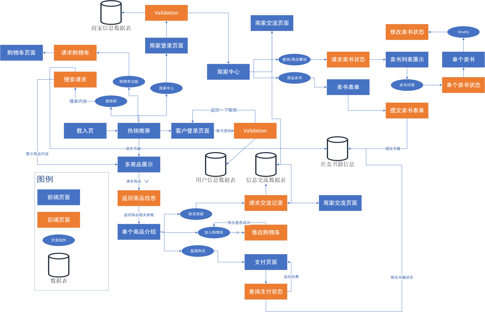

# Second-Hand-Sale-System中文文档

嗨，这是一个基于React+DAO架构的小型二手书交易系统，由Get、Gjl和yh在一周半的时间中完成。如果感兴趣可以通过我的邮箱与我取得联系~

## 环境配置及需求

### 前端环境及配置

- Node.js前端包管理工具 版本：20.11.0 （LTS 长期维护版本，自带npm）
- React 前段开发框架

### 后端环境及配置

- Jdk Java开发工具 版本：1.8

- Tomcat 后端部署本地服务器 版本：9.0.84

- Maven包管理工具
- Intellij IDEA编译器版本：2023.02

### 数据库环境及配置

- SQL Server 2022版本
- SQL语句及命令在

## 本地调试配置

### 前端配置

克隆到本地

``````bash
git clone https://github.com/Getttttttt/Second-Hand-Sale-System
``````

首先进入前端进行部署

```bash
cd /front-end/second-hand-system
```

注意：请确保电脑上有长期维护版本的node.js，对于react框架，初次Clone到本地需要对于相关包文件进行安装与下载配置：

```bash
npm install
```

之后可以通过`start`以开发者模式运行，也可以直接在build后的版本中进行扩展。（我在`package.json`文件中将代码部署端口设置为`9000`，如果9000端口已被占用，可自行修改，但是修改需要对于后端中的`Controller`内部所有接口的同源策略进行调整）

```bash
npm start
```

### 后端配置

后端需要在`Second-Hand-Sale-System\back-end\ApplicationInterface\SecondHandSystemAPIs`中打开IDEA，请确保IDEA版本、Tomcat版本以及JDK版本与前面的要求相一致，我们的后端默认是部署在`8080`端口中，请勿轻易变动，会导致前后端的连接出现问题。

## 功能介绍



